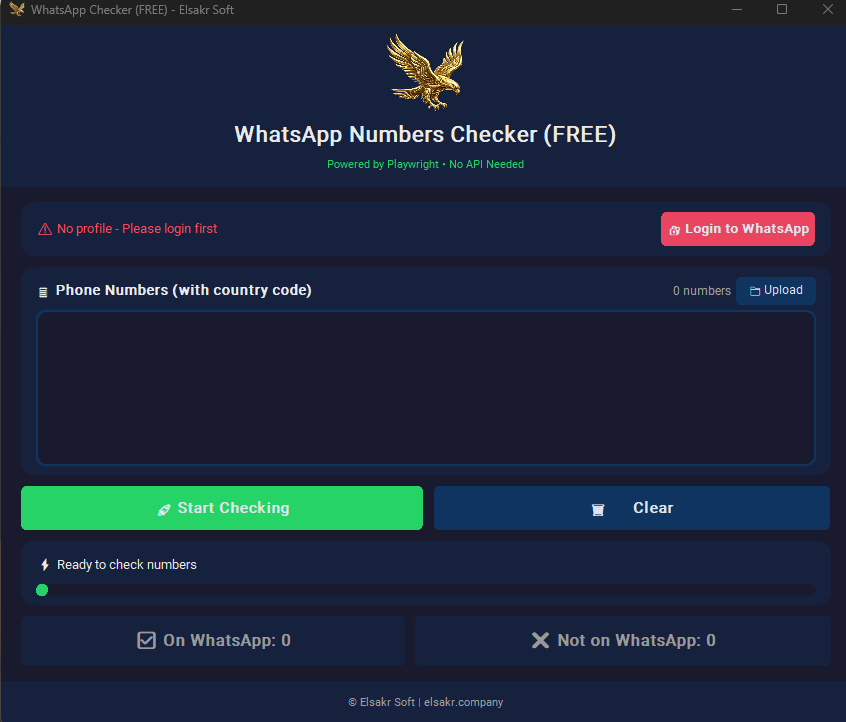

# 🦅 WhatsApp Free GUI Checker

[](https://elsakr.company)
[](https://elsakr.company)
[](../../LICENSE)

## Overview
Part of the **Elsakr Open Source Tools Ecosystem** — global proactive solutions for developers, designers, and marketers.
> **[View All Tools](https://elsakr.company/tools)**

**Zero Cost. Maximum Value.**
This tool uses browser automation (Playwright) to verify numbers by simulating a real WhatsApp Web session. Perfect for freelancers who want to verify lists without paying for API access.

## 🚀 Features
- 🔹 **Completely Free**: Uses your own WhatsApp Web session.
- 🔹 **QR Login**: Safe, standard login process.
- 🔹 **Visual Feedback**: Watch the automation work in real-time.
- 🔹 **No Ban Risk**: Mimics human behavior to separate valid numbers.

## 📸 Screenshots / Demo


## 📦 Getting Started

### 💻 Installation
1. Install Python & Playwright.
   ```bash
   pip install playwright
   playwright install chromium
   ```
2. Navigate to the directory:
   ```bash
   cd PlayWright/GUI
   ```
3. Install dependencies:
   ```bash
   pip install -r requirements.txt
   ```

### ▶️ Usage
Run the application:
```bash
python main.py
```
1. Scan the QR code when the browser opens.
2. Import your numbers.
3. Start checking.

## 🤝 Contributing
We welcome contributions! See the Master README for guidelines.

## 📝 License
This project is licensed under the MIT License.

## ⭐ Signature
**Elsakr** — *Open Source Tools with a Falcon’s Vision.*  
[elsakr.company](https://elsakr.company)

---

# 🇪🇬 النسخة العربية (Arabic Version)

## 🦅 فاحص الواتساب (مجاني GUI)
للمبتدئين والـ Freelancers. افحص أرقام ببلاش عن طريق متصفح واتساب ويب. سجل دخول بالـ QR Code وسيب الأداة تشتغل لوحدها.
