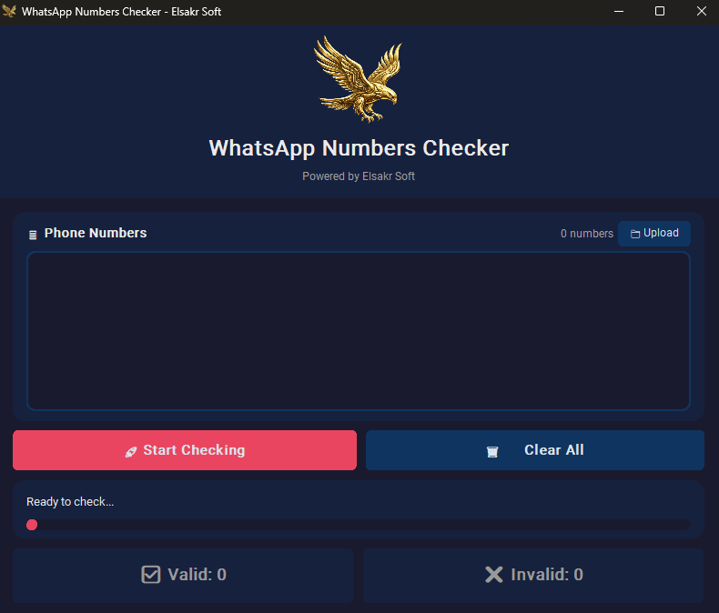
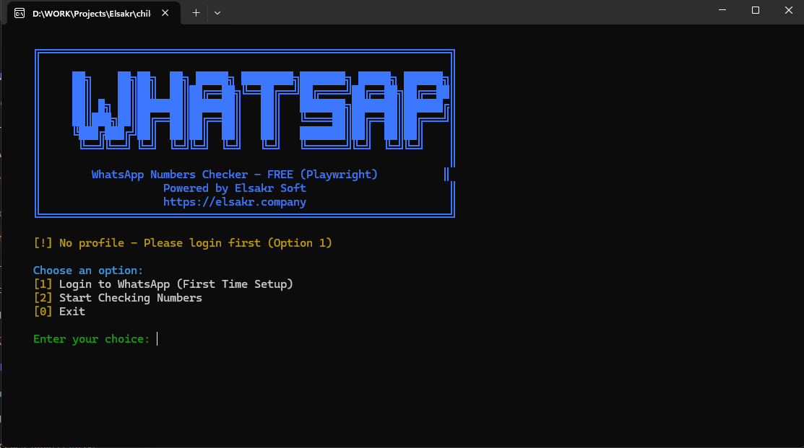

# 🦅 Elsakr WhatsApp Marketing Suite

[](https://elsakr.company)
[](https://elsakr.company)
[](LICENSE)


## Overview
Part of the **Elsakr Open Source Tools Ecosystem** — global proactive solutions for developers, designers, and marketers.
> **[View All Tools](https://elsakr.company/tools)**

**A comprehensive, local-first ecosystem for WhatsApp marketing automation.**
Whether you are an agency needing high-speed accuracy, a developer building headless scripts, or a freelancer looking for free tools, this suite has it all. Zero subscriptions. Zero data harvesting. 100% Privacy.

---

## 🚀 Features
- 🔹 **Multi-Engine Core**: Choose between **Official API** (High Speed) or **Playwright** (Free Automation).
- 🔹 **Dual-Mode Operation**: Available as a robust **GUI Desktop App** and a lightning-fast **CLI Terminal**.
- 🔹 **Privacy First**: All data processing happens locally on your machine.
- 🔹 **Bulk Capability**: Verify 10,000+ numbers in minutes with verified accuracy.
- 🔹 **Smart Reporting**: Export verified leads directly to CSV/Excel.

---

## 📸 Visual Tour
Check out the tools in action:

| **API GUI** | **API Terminal** |
|:---:|:---:|
|  |  |
| *High-speed Checking* | *Blazing Fast Scripting* |

| **Free GUI** | **Free Terminal** |
|:---:|:---:|
|  |  |
| *Visual Automation* | *Headless Power* |

---

## 📦 Getting Started

### 💻 Installation
Clone the repository to get the entire suite:

```bash
git clone https://github.com/khalidsakrjoker/whatsapp-numbers-checker.git
cd whatsapp-numbers-checker
```

### ▶️ Usage
Navigate to the specific tool you need:

| Tool | Type | Directory |
|------|------|-----------|
| **WhatsApp API GUI** | Desktop | `cd API/GUI` |
| **WhatsApp API Terminal** | CLI | `cd API/Terminal` |
| **WhatsApp FREE GUI** | Desktop | `cd PlayWright/GUI` |
| **WhatsApp FREE Terminal** | CLI | `cd PlayWright/Terminal` |

*Refer to the `README.md` inside each folder for specific run instructions.*

---

## 🤝 Contributing
We welcome contributions!
1. Fork the repo.
2. Create your feature branch (`git checkout -b feature/AmazingFeature`).
3. Commit your changes.
4. Push to the branch.
5. Open a Pull Request.

## 📝 License
This project is licensed under the MIT License.

## ⭐ Signature
**Elsakr** — *Open Source Tools with a Falcon’s Vision.*  
[elsakr.company](https://elsakr.company)

---

# 🇪🇬 الرؤية المصرية (Arabic Version)

## 🦅 مكتبة أدوات الواتساب من الصقر
مجموعة أدوات مفتوحة المصدر (Open Source) للمسوقين والمطورين. مفيش اشتراكات، مفيش سرقة بيانات، ومفيش رسوم مخفية.

**أدواتك كلها هنا:**
1. **[WhatsApp API GUI](./API/GUI)**: سرعة ودقة للمحترفين.
2. **[WhatsApp API Terminal](./API/Terminal)**: سكريبتات للمبرمجين.
3. **[WhatsApp FREE GUI](./PlayWright/GUI)**: مسح QR Code وبدأ الشغل (مجاني).
4. **[WhatsApp FREE Terminal](./PlayWright/Terminal)**: أتمتة كاملة في الخلفية.

<div align="center">
  
  <p><strong>Elsakr — Open Source Tools with a Falcon’s Vision.</strong></p>
</div>
